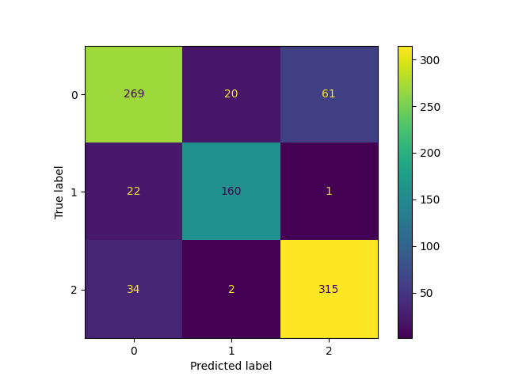
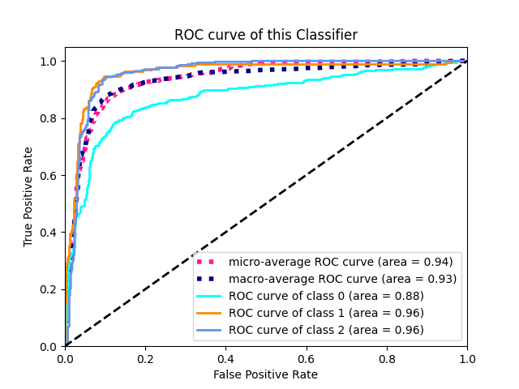
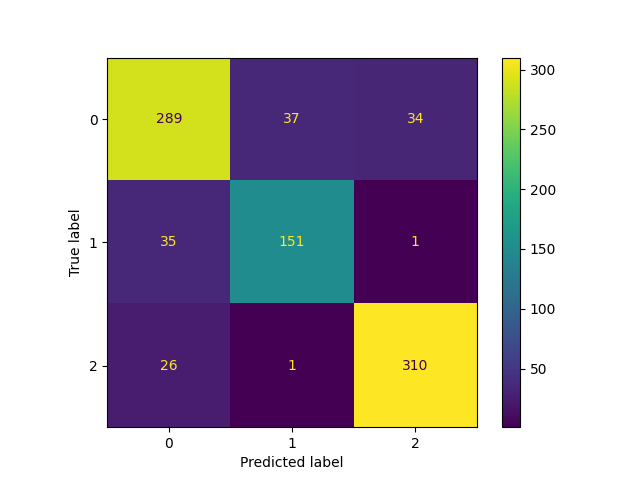
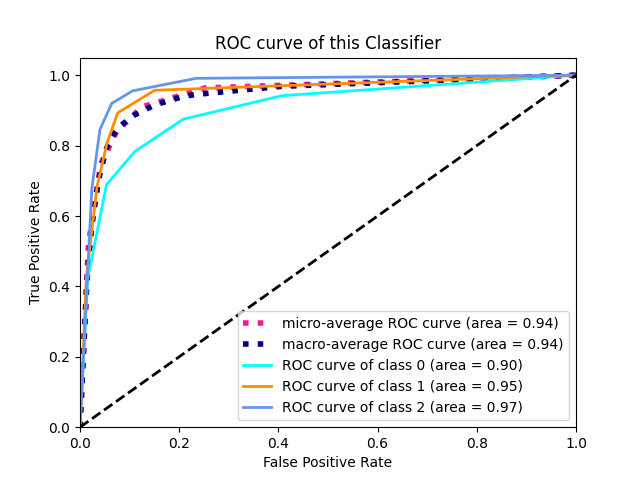
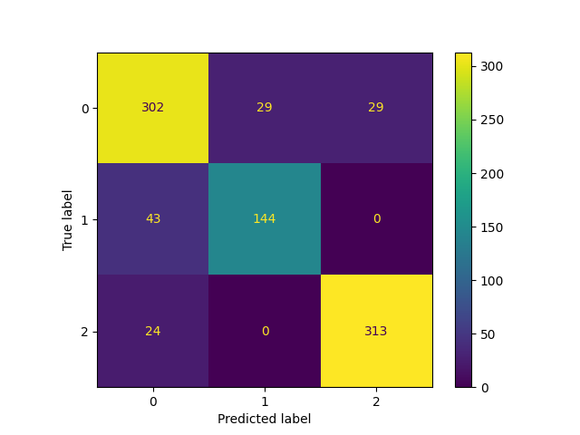
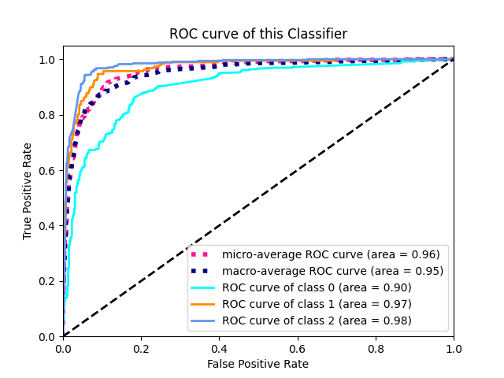

# 数据仓库与数据挖掘大作业

| 工作   | 任务一的大体框架+任务二的KMeans自行实现 | 任务二的大体框架+任务一的KNN实现 |
| ------ | --------------------------------------- | -------------------------------- |
| 完成人 | 孙璋亮                                  | 梁好                             |

## 任务一 患者肺损伤辅助决策

### 评价指标

​		本次实验指标采用f1 score是分类器常用的评价指标之一。能够有效的评判分类器的好坏。实验中采用5折交叉验证，实验结果采用的是第一次划分的结果。

### 预处理

​		在本次任务重，由于表格提供的数据多，也就是可能影响最终分类结果的数据多。另外，对于提供的数据，很多存在缺失项，对于这些缺失项，采用中值填充的方法填充。

​		另外，对于数据进行归一化也是很重要的一点，归一化后的数据在同一尺度，防止某些特征的量纲大小对于最终的结果产生不利的影响。本任务中我们采用标准化对数据进行处理。

### 特征选择

​		由于本次任务提供的数据集中存在很多的数据维度，为了减少模型的参数量。需要对数据的特征进行筛选。

在没有进行特征选择前，有42个特征维度。模型参数很大。

​		在本次任务中，可以采用多种特征选择方法，本次任务中，我们尝试了embbed，warp，filter方法。其中embbed方法采用了SVMClassifier的正则化参数C（设置为0.01）实现。filter方法采用互信息和chi方方法选择。wrap方法采用递归特征筛选（RFE）实现，使用岭回归器作为选择器。

### 实验结果与分析

>本次实验中，我们自行实现了KNeighbourClassifier分类器。这种分类器利用特征维度上最接近的点的标签作为指导生成自己的标签的预测。

#### 预处理

​		对于数据，首先我们讲标签数值化。设置性别的特征值男为0，女为1。

​		如果不对数据进行填补和规范化，最终完全拥有所有维度信息的病例数为10条，10条数据是完全不能训练的，且这10条数据中，导致最终类别出现误差，例如部分标签类别并未在这10条数据中出现过。

​		在实际测试中发现了如上问题，直接丢弃存在特征维度空缺的数据导致分类器完全不能使用，f1-score为0.4。这说明分类器没有学习好分类规则。同时注意到，标签为2类别的数据在这些数据里没有出现。accuracy只有0.4。效果非常差。

|              | precision | recall | f1-score | support |
| ------------ | --------- | ------ | -------- | ------- |
| 0            | 0.00      | 0.00   | 0.00     | 3       |
| 1            | 0.40      | 1.00   | 0.57     | 2       |
| accuracy     |           |        | 0.40     | 5       |
| macro avg    | 0.20      | 0.50   | 0.29     | 5       |
| weighted avg | 0.16      | 0.40   | 0.23     | 5       |

​			对于特定的分类器不能接受特征为负值，在这一点上我们也可以通过标准归一化进行数据预处理。本次任务中我们采用的是标准归一化。

#### 特征选择

​		对于原有的特征，我们选取使用互信息作为标准的过滤方法。在原有的特征维度上，分别选取5，12，20个分类特征。基本的想法是选取和最终标签关联最大的特征。利用互信息选取5，12，20个分类特征后。采用K近邻方法分类器的效果如下。

##### 	采用特征维度为5

|              | precision | recall | f1-score | support |
| ------------ | --------- | ------ | -------- | ------- |
| 0            | 0.69      | 0.76   | 0.72     | 360     |
| 1            | 0.67      | 0.49   | 0.56     | 187     |
| 2            | 0.86      | 0.90   | 0.88     | 337     |
| accuracy     |           |        | 0.75     | 884     |
| macro avg    | 0.74      | 0.71   | 0.72     | 884     |
| weighted avg | 0.75      | 0.75   | 0.75     | 884     |

#####采用特征维度为12

|              | precision | recall | f1-score | support |
| ------------ | --------- | ------ | -------- | ------- |
| 0            | 0.83      | 0.80   | 0.81     | 360     |
| 1            | 0.80      | 0.81   | 0.80     | 187     |
| 2            | 0.90      | 0.92   | 0.91     | 337     |
| accuracy     |           |        | 0.85     | 884     |
| macro avg    | 0.84      | 0.84   | 0.84     | 884     |
| weighted avg | 0.85      | 0.85   | 0.85     | 884     |

##### 采用特征维度为20
|              | precision | recall | f1-score | support |
| ------------ | --------- | ------ | -------- | ------- |
| 0            | 0.81      | 0.72   | 0.76     | 360     |
| 1            | 0.83      | 0.80   | 0.82     | 187     |
| 2            | 0.81      | 0.92   | 0.86     | 337     |
| accuracy     |           |        | 0.81     | 884     |
| macro avg    | 0.82      | 0.81   | 0.81     | 884     |
| weighted avg | 0.81      | 0.81   | 0.81     | 884     |

​			可以发现在提升最终使用的特征维度时，分类起的效果先变好再变差，这说明很多特征是无用的甚至会导致模型过拟合影响分类器效果的。但是选择较小的特征维度也会导致分类器效果不理想。采用特征选择的方法能够减少模型参数，同时保证分类器的效果。

#### 分类效果

>本次实验中，对比了三种分类器，分别是支持向量机分类器、K最近邻分类器，AdaBoost分类器。下面描述三种分类器的差异。

##### 支持向量机分类器

准确率0.84。

###### 混淆矩阵和ROC曲线

##### K最近邻分类器

准确率0.85。

###### 混淆矩阵和ROC曲线

##### Adaboost分类器

准确率0.85。

###### 混淆矩阵和ROC曲线

#### 各个算法的效果比较

​		在使用相同的12个特征维度时，我们测试的分类器效果较为类似。这说明各个分类器的分类标准可能类似，分类器确实学习到了一定的分类标准。

​		注意到支持向量机分类器的运行时间更长，这说明SVC的训练其他的方法更慢一些。

#### 自行实践的算法与库的差异

​		对比自行实现的K近邻分类器与sklearn分类器的差别，发现最终效果上差异不大，由于K近邻方法标准较为统一，且复杂度不高，所以自行实现的算法与库提供的分类器存在的差异大部分是代码的完备性与完整性的差异。

#### 超参数选择

​		我们采用枚举法直接设置分类器的超参数。发现以下几点。

1. 对于K近邻分类器，我们采取的K邻居在5-30之间效果差异不大。在K较大（>1000)时，效果变差。
2. SVC的正则化项C取值从1逐渐变小的过程中，准确度不断减小。